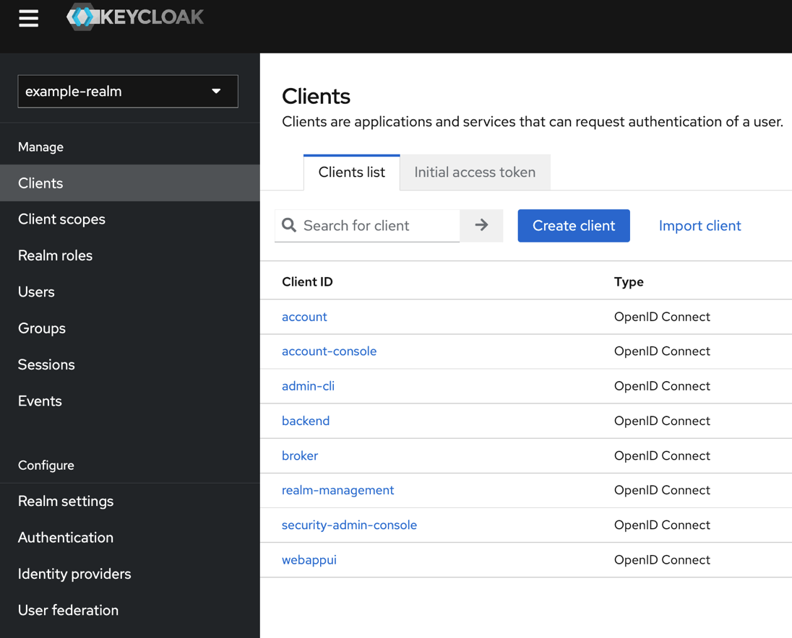

# Create a realm in Keycloak 20.0.1 using bash scripting

Simple example to create a realm in Keycloak using bash scripting for local development.

1. Start Keycloak in a local container in the development mode.
2. Use `cURL` to authenticate to get a [`JWT`](https://jwt.io/) to access the master realm to create the new example-realm.

3. Use the `cURL` with the given `JWT` `access-token` to create the `example-realm`.


### Step 1: Clone the project

```sh
git clone https://github.com/thomassuedbroecker/keycloak-create-realm-bash.git
cd keycloak-create-realm-bash/scripts
```

### Step 2: Start Keycloak locally in the development mode

```sh
sh ./local-start-keycloak.sh
```

* Example output:

```sh
Updating the configuration and installing your custom providers, if any. Please wait.
2022-12-12 19:30:35,726 INFO  [io.quarkus.deployment.QuarkusAugmentor] (main) Quarkus augmentation completed in 5105ms
...
2022-12-12 19:30:43,666 INFO  [org.keycloak.services] (main) KC-SERVICES0009: Added user 'admin' to realm 'master'
2022-12-12 19:30:43,670 WARN  [org.keycloak.quarkus.runtime.KeycloakMain] (main) Running the server in development mode. DO NOT use this configuration in production.
```

### Step 3: Open a new terminal with the same folder

```sh
pwd
```

* Example output:

```sh
/Users/..../keycloak-create-realm-bash/scripts
```

### Step 4: Create the new realm

```sh
sh ./local-configure-keycloak.sh
```

* Example output:

```sh
************************************
 Configure Keycloak realm
************************************
  % Total    % Received % Xferd  Average Speed   Time    Time     Time  Current
                                 Dload  Upload   Total   Spent    Left  Speed
100  1887  100  1818  100    69   3393    128 --:--:-- --:--:-- --:--:--  3580
Access token : eyJhbGciOiJSUzI1NiIsInR5cCIgOiAiSldUIiwia2lkIiA6ICIyTXNJRzdtWmhCRWFoaWc2X2ItclNxLVBoRnlkczNjUF8yd3U5OHBrSDE0In0.eyJleHAiOjE2NzA4NDk5NTgsImlhdCI6MTY3MDg0OTg5OCwianRpIjoiN2E4NTYxZmEtN2NhZi00NjE5LWEyMDEtMzFiNTEwMTA4OGY3IiwiaXNzIjoiaHR0cDovL2xvY2FsaG9zdDo4MDgwL3JlYWxtcy9tYXN0ZXIiLCJzdWIiOiJlMjQ5ZjBkNC01Njk0LTRiZTAtOTI4MS0xOWIwMTVkNzFlMGUiLCJ0eXAiOiJCZWFyZXIiLCJhenAiOiJhZG1pbi1jbGkiLCJzZXNzaW9uX3N0YXRlIjoiZDIxYzU3M2ItZGQyMS00MWZmLTlkZWEtM2I4ZDRkZTAzNzc5IiwiYWNyIjoiMSIsInNjb3BlIjoicHJvZmlsZSBlbWFpbCIsInNpZCI6ImQyMWM1NzNiLWRkMjEtNDFmZi05ZGVhLTNiOGQ0ZGUwMzc3OSIsImVtYWlsX3ZlcmlmaWVkIjpmYWxzZSwicHJlZmVycmVkX3VzZXJuYW1lIjoiYWRtaW4ifQ.ZwWiv0Q-VWpwKzOjg_7YbkIAL_29AfNbGoqJoNKA8eCwpnplFKwv6HYlp3VfsFPVvO4hjekfxq8vXrx6QugBkE5fo7PJ06zDHFbtNzOmWR7RpX9Q4uOjRAHq2Gnvs3sHqEWUX0O4dkm5TRW81Cu7GTfiHgZkRtsVMk1OjV7ZtSJ7Ke4dK5C-IIvdNjN_NYxYq7fkWj2_hVqeHRLp31OXu8p8DgQeEKQo940kSu8yCMHQG-QjISiasu9onS94GkOep8DWIGpLQvzndBDMvmr-zHX_519CPldXpkbrwh3nUVM3JGaXdcn3CMloNFgZjgTujWgpThZKiUOah53vxI7qoA
------------------------------------------------------------------------
Create the realm in Keycloak
------------------------------------------------------------------------

  % Total    % Received % Xferd  Average Speed   Time    Time     Time  Current
                                 Dload  Upload   Total   Spent    Left  Speed
100 70726    0     0  100 70726      0  64574  0:00:01  0:00:01 --:--:-- 65065
------------------------------------------------------------------------
The realm is created. 
Open following link in your browser:
http://localhost:8080/admin/master/console/#/example-realm
------------------------------------------------------------------------
```


